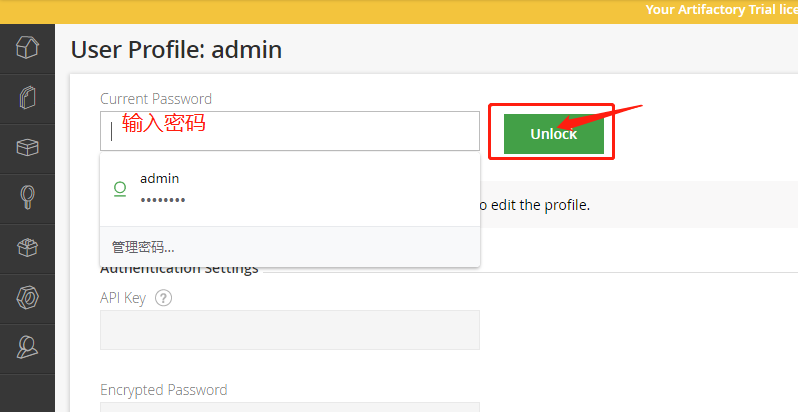
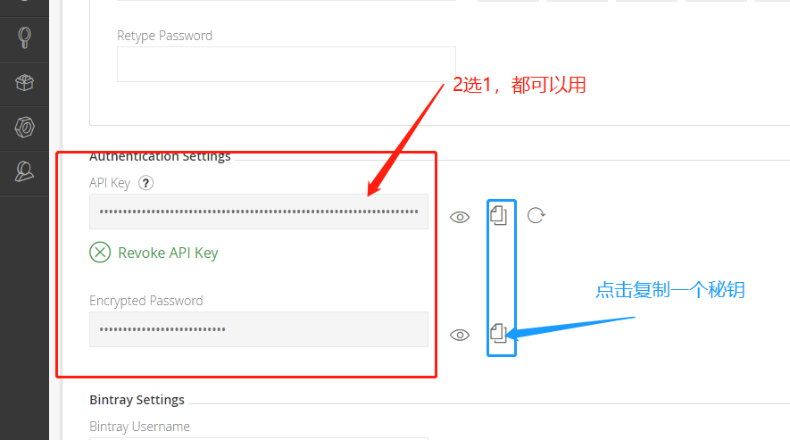
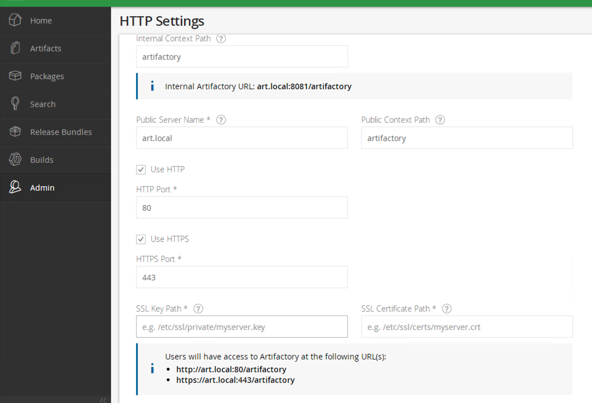

# 1.1 How to using jfrog client?


[Jfrog CLI help document](https://www.jfrog.com/confluence/display/CLI/JFrog+CLI)

> download jfrog client [https://jfrog.com/getcli/](https://jfrog.com/getcli/)

Templete for centos:

```text
[root@Artifactory01 ~]# curl -fL https://getcli.jfrog.io | sh

# error like follow is the jfrog cli download failed,try again.
[root@Artifactory01 ~]# ./jfrog help
Segmentation fault

# this is runed correct of jfrog client that return the message
[root@Artifactory01 jfrog]# jfrog
NAME:
   jfrog - See https://github.com/jfrog/jfrog-cli-go for usage instructions.

USAGE:
   jfrog [global options] command [command options] [arguments...]

VERSION:
   1.34.1

COMMANDS:
   rt          Artifactory commands
   bt          Bintray commands
   mc          Mission Control commands
   xr          Xray commands
   completion  Generate autocomplete scripts
   help, h     Shows a list of commands or help for one command

GLOBAL OPTIONS:
   --help, -h     show help
   --version, -v  print the version
```

运行`./jfrog` 会创建一个目录 `/<user>/.jfrog`

> 获取 API key

先获取`API KEY` 等下用得到,流程如下: 

1. 登录artifactory,点击右上角  
 

2. 输入密码，点击unlock

  

3. 解锁后，往下拉`API KEY`和`PASSWORD`任选其一  


> 设置 jfrog-cli 配置

```bash
# 开始设置jfrog配置
[root@Artifactory01 jfrog]# ./jfrog rt config  
# 服务ID，这个可以自定义，我这里定义的是 第一个 artifactory 
Artifactory server ID [1]: art1                
# artifactory链接地址
Artifactory URL [http://art.local/artifactory/]: http://art.local/artifactory/  
# 使用的认证策略，我这里使用的是密码而不是API token，所以这里直接回车跳过
Access token (Leave blank for username and password/API key): 
# 输入账号
User [admin]: admin
# 输入之前获得的 API Key 或者 Password
Password/API key: 
Is the Artifactory reverse proxy configured to accept a client certificate? (y/n): n
[Info] Encrypting password...
# 完成配置
```

完成配置后会在`/<user>/.jfrog`目录下生成一个`jfrog-cli.config`配置文件

```text
[root@ykpocjenkins .jfrog]# cat jfrog-cli.conf 
{
  "artifactory": [
    {
      "url": "https://art.local/artifactory/",
      "user": "admin",
      "password": "<password>",
      "serverId": "art1",
      "isDefault": true
    }
  ],
  "Version": "1"
}
```

> jfrog-cli CI-CD过程go相关的指令

```bash
# 除了配置文件设置config还可以通过命令行设置
# jfrog rt c == jfrog rt config
jfrog rt c art1 --url=http://jfrog.local/artifactory --user=admin --password=<password>

# jfrog rt use <server-id> 这里的 server-id 是之前config中设置的
jfrog rt use art1

# 设置GOPROXY的环境变量格式如:  <protocol>://<username>:<password>@<artifactory domain>/api/go/<go repository>
env.GOPROXY="http://<username>:<password>@jfrog.local/artifactory/api/go/go"

# 构建go项目,--build-name,--build-number皆为元数据收集，通过build-name对应artifactory内的build
jfrog rt go install go --build-name=${env.JOB_NAME} --build-number=${env.BUILD_NUMBER}

# gp 推送 Go Packages 到 artifactory
# jfrog rt gp == jfrog rt go-publish
jfrog rt gp go v1.16.2.${env.BUILD_NUMBER} --deps=ALL --build-name=${env.JOB_NAME} --build-number=${env.BUILD_NUMBER}

# bce(build-collect-env)收集环境变量
jfrog rt bce ${env.JOB_NAME} ${env.BUILD_NUMBER}

# Publishing Build Information
jfrog rt bp ${env.JOB_NAME} ${env.BUILD_NUMBER}

# Scanning a Published Build，调用Xray进行扫描
jfrog rt bs ${env.JOB_NAME} ${env.BUILD_NUMBER}
```

## 常见错误

> artifactory证书错误

```bash
[root@ykpocjenkins middleman-server2]# jfrog rt go install go --build-name=middleman-server2 --build-number=1
[Info] Using go: go version go1.13.5 linux/amd64

go: downloading github.com/gin-gonic/gin v1.5.0
build git.myscrm.cn/tools/middleman-server2: cannot load github.com/gin-gonic/gin: github.com/gin-gonic/gin@v1.5.0: refusing to pass credentials to insecure URL: http://***.***@art.local/artifactory/api/go/go/github.com/gin-gonic/gin/@v/v1.5.0.zip
{
  "status": "failure",
  "totals": {
    "success": 0,
    "failure": 1
  }
}
exit status 1
```

* 原因: jfrog go install 会代理github，而github是不支持忽略证书的，而artifactory站点没有使用https协议
* 解决办法： 开启https协议即可

```bash
# 使用 mkcert 创建证书

mkcert -install
mkcert art.local 127.0.0.1 ::1
# 将生成的证书放到artifactory可以访问目录，配置目录artifactory即可
```



