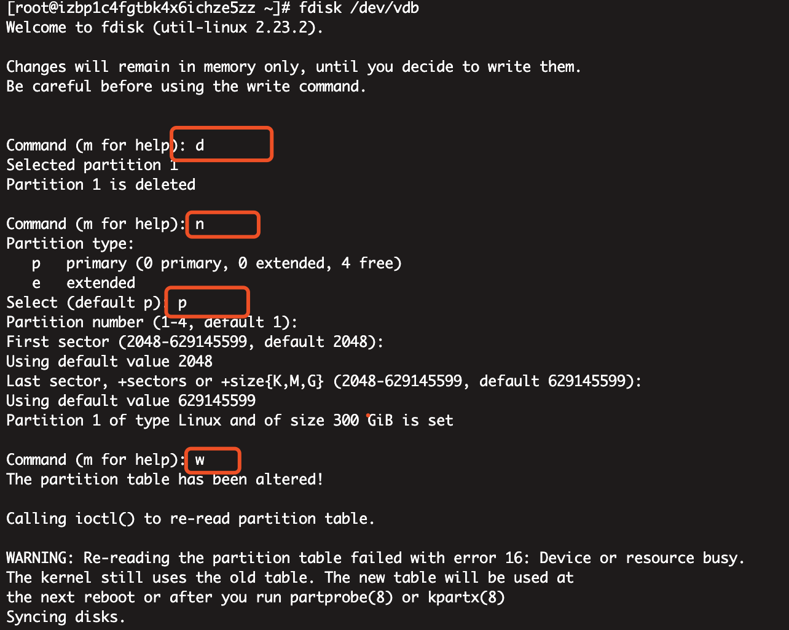

# 1.1 在线扩容及遇到的问题


> 一般操作\(非LVM\)

1. 分区扩容 

   

2. 通知分区更新 partx -u /dev/vdb1
3. 更新分区大小 resize2fs /dev/vdb1
4. du -h 检查分区是否改变

> 在线扩容resize2fs 提示 resize2fs: Permission denied to resize filesystem：

```text
（k8s集群，先添加临时node，然后排空扩容硬盘错误的pod，之后再进行如下操作）
1. 注释 fstab中/dev/vdb1的映射,重启机器
2. e2fsck -y /dev/vdb1 检查磁盘
3. resize2fs /dev/vdb1 
4. lsblk 查看磁盘大小是否变化
5. 取消fstab中的注释，重启机器
6. 扩容节点重新上线
7. 排空临时节点
8. 释放临时节点
9. 完成
```

> LVM扩容

```text
# 查看硬盘情况
[root@apm-es-01 ~]# fdisk -l

Disk /dev/vda: 107.4 GB, 107374182400 bytes, 209715200 sectors
Units = sectors of 1 * 512 = 512 bytes
Sector size (logical/physical): 512 bytes / 512 bytes
I/O size (minimum/optimal): 512 bytes / 512 bytes
Disk label type: dos
Disk identifier: 0x0008d73a

   Device Boot      Start         End      Blocks   Id  System
/dev/vda1   *        2048   209713151   104855552   83  Linux
# 磁盘大小已经变了
Disk /dev/vdb: 1073.7 GB, 1073741824000 bytes, 2097152000 sectors
Units = sectors of 1 * 512 = 512 bytes
Sector size (logical/physical): 512 bytes / 512 bytes
I/O size (minimum/optimal): 512 bytes / 512 bytes


Disk /dev/mapper/vg01-lv01: 536.9 GB, 536866717696 bytes, 1048567808 sectors
Units = sectors of 1 * 512 = 512 bytes
Sector size (logical/physical): 512 bytes / 512 bytes
I/O size (minimum/optimal): 512 bytes / 512 bytes

# 查看pv
[root@apm-es-01 ~]# pvs
  PV         VG   Fmt  Attr PSize    PFree
  /dev/vdb   vg01 lvm2 a--  <500.00g    0

# 更新pv
[root@apm-es-01 ~]# pvresize /dev/vdb
  Physical volume "/dev/vdb" changed
  1 physical volume(s) resized or updated / 0 physical volume(s) not resized

# 不确定要不要更新 VG
# 可以参考https://help.aliyun.com/document_detail/131141.html?spm=a2c4g.11186623.2.10.581d39faJGe2tf#task-1797417

# 更新lv
lvresize -l +100%FREE /dev/mapper/vg01-lv01

# 更新分区信息
resize2fs /dev/mapper/vg01-lv01
```

